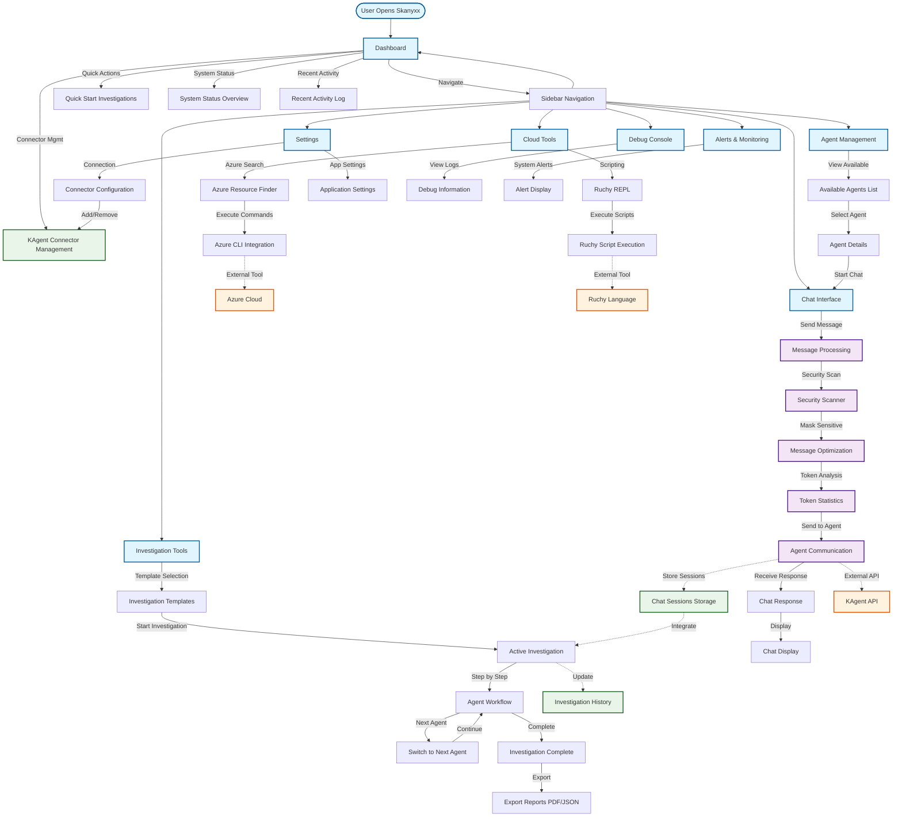

# Skanyxx - User Experience Flow Diagram

## Key User Journeys

### 1. Investigation Workflow
1. **Start Investigation**: User selects from predefined templates or creates custom investigation
2. **Agent Selection**: System automatically selects appropriate agents for the investigation type
3. **Step-by-Step Process**: User progresses through investigation steps with different agents
4. **Chat Integration**: Each step involves chat interaction with specialized agents
5. **Report Generation**: Investigation results are exported as PDF or JSON reports

### 2. Chat with AI Agents
1. **Agent Selection**: User chooses from available AI agents (K8s, Observability, PromQL, etc.)
2. **Message Input**: User types message with real-time security scanning
3. **Message Processing**: System scans for sensitive data and optimizes for token efficiency
4. **Agent Communication**: Message sent to selected agent via KAgent API
5. **Response Display**: Agent response displayed with markdown rendering and token statistics

### 3. Cloud Tools Usage
1. **Tool Configuration**: System checks availability of Azure Resource Finder and Ruchy
2. **Azure Integration**: User can search Azure resources with authentication status checking
3. **Scripting**: User can write and execute Ruchy scripts with context management
4. **Results Display**: Command outputs displayed with proper formatting and error handling

### 4. System Management
1. **Connector Management**: Add/remove KAgent connectors with connection status monitoring
2. **Settings Configuration**: Configure application settings and connection parameters
3. **Debug Monitoring**: View system logs and debug information for troubleshooting
4. **Alert Management**: Monitor system alerts and notifications
