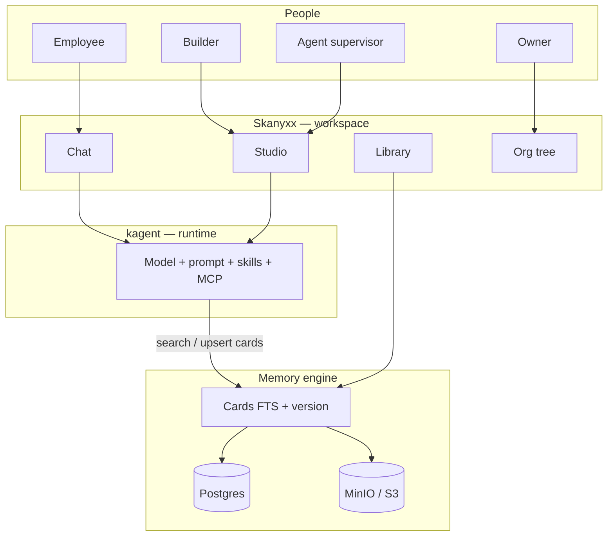
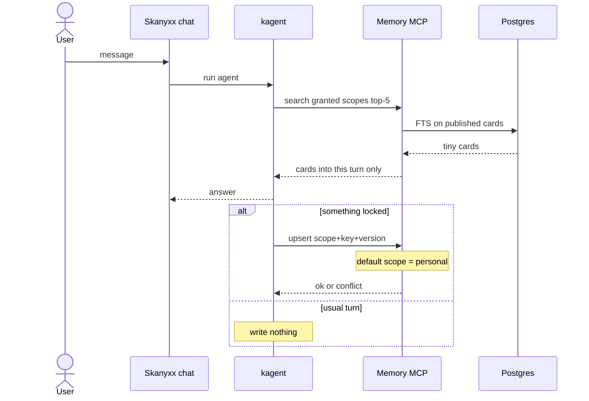
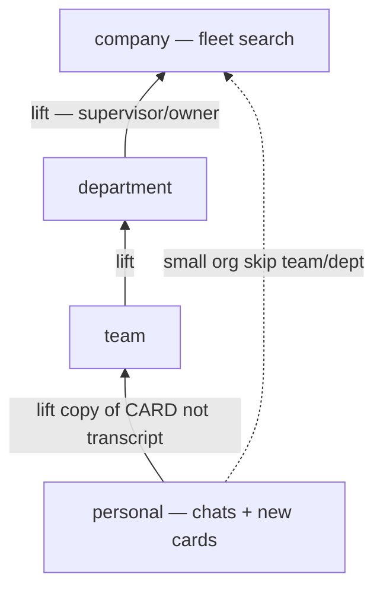
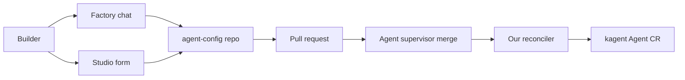
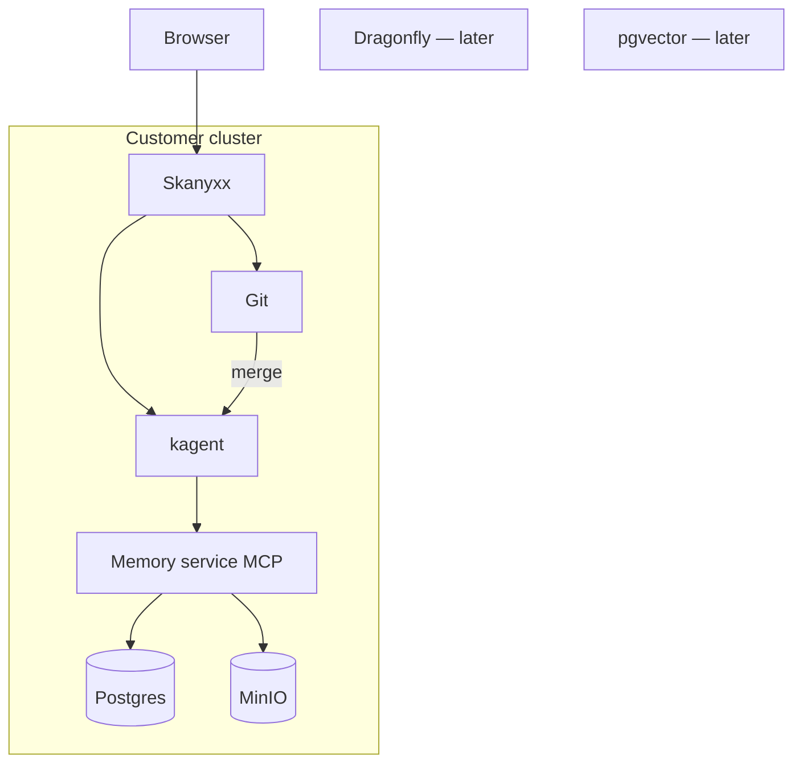
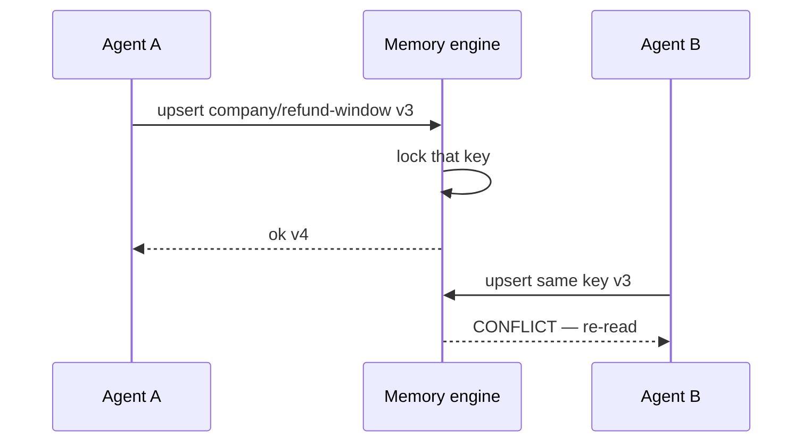

# Diagrams

How the locked design fits together. Open in preview for the graphs.

## 1. Three planes (one customer install)

Skanyxx does not run the LLM. kagent does not own company knowledge.

## 2. One chat turn

## 3. Lift knowledge out of private chats

Chats never move. Cards copy up. Personal copy stays.

## 4. New agent: factory or studio → git PR

Employees never see the agent until merge. Preview is sandbox, search-only on production memory.

## 5. Day-one stack on customer Kubernetes

## 6. Two writers, one key

No Redis bus. Engine serializes the **key**. Dragonfly only if we run several memory replicas.
